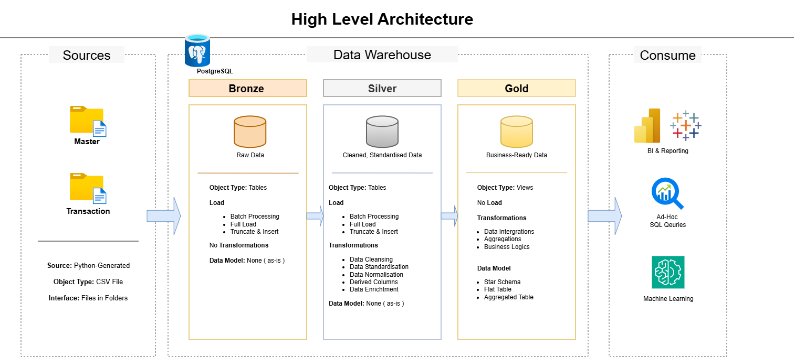

# sql-data-warehouse-project

Welcome to the **Data Warehouse and Analytics Project** repository! 🚀  
This project demonstrates a comprehensive data warehousing and analytics solution, from building a data warehouse to generating actionable insights. Designed as a portfolio project, it highlights industry best practices in data engineering and analytics.

---
## 🏗️ Data Architecture

The data architecture for this project follows Medallion Architecture **Bronze**, **Silver**, and **Gold** layers:


1. **Bronze Layer**: Stores raw data as-is from the source systems. Data is ingested from CSV Files into PostgreSQL Database.
2. **Silver Layer**: This layer includes data cleansing, standardization, and normalization processes to prepare data for analysis.
3. **Gold Layer**: Houses business-ready data modeled into a star schema required for reporting and analytics.

---
## 📖 Project Overview

This project involves:

1. **Data Architecture**: Designing a Modern Data Warehouse Using Medallion Architecture **Bronze**, **Silver**, and **Gold** layers.
2. **ETL Pipelines**: Extracting, transforming, and loading data from source systems into the warehouse.
3. **Data Modeling**: Developing fact and dimension tables optimized for analytical queries.
4. **Analytics**: Creating SQL-based reports for actionable insights.

---

## 🛠️ Important Links & Tools:
- **[PostgreSQL](https://www.postgresql.org/download/):** Server for hosting your SQL database.
- **[pgAdmin](https://www.pgadmin.org/download/):** GUI for managing and interacting with databases.

---

## 🚀 Project Requirements

### Building the Data Warehouse (Data Engineering)

#### Objective
Develop a modern data warehouse using PostgreSQL to consolidate sales data, enabling analytical reporting and informed decision-making.

#### Specifications
- **Data Sources**: Import Python-generated data divided into two folders (master_data, transaction_data) provided as CSV files.
- **Data Quality**: Cleanse and resolve data quality issues prior to analysis.
- **Integration**: Combine the folders into a single, user-friendly data model designed for analytical queries.
- **Scope**: Focus on the latest dataset only; historization of data is not required.
- **Documentation**: Provide clear documentation of the data model to support both business stakeholders and analytics teams.

---

### BI: Analytics & Reporting (Data Analysis)

#### Objective
Develop SQL-based analytics to deliver detailed insights into:
- **Customer Behavior**
- **Product Performance**
- **Sales Trends**

## 📂 Repository Structure
```
data-warehouse-project/
│
├── datasets/                           # Raw datasets used for the project (Master and Transaction data)
│
├── docs/                               # Project documentation and architecture details
│   ├── data_architecture.drawio        # Draw.io file shows the project's architecture 
|   ├── data_catalog.md                 # Contains detailed Description of the Tables 
│   ├── data_flow.drawio                # Shows how the Data Flow along the three Layers
|   ├── data_model                      # Shows how the dimensions and facts connect (Star Schema)
|
├── reports/                            # Answer some business questions.
|
├── scripts/                            # SQL scripts for ETL and transformations
│   ├── bronze/                         # Scripts for extracting and loading raw data
│   ├── silver/                         # Scripts for cleaning and transforming data
│   ├── gold/                           # Scripts for creating analytical models
│
├── tests/                              # Test scripts and quality files
│
├── LICENSE                             # License information for the repository
└── README.md                           # Project overview and instructions
```

## 🚀 How to Run

1. Install PostgreSQL and pgAdmin
3. Use the command line and run `psql -U postgres -h localhost -c 'CREATE DATABASE datawarehouse;`
4. Then run `psql -U postgres -h localhost -d datawarehouse -f init_database.sql`
5. For each bronze, silver folders, run the DDL script first and then follow the instructions in the comments for the other script
6. For the gold folder follow the instructions in the comments of the DDL script

---

## 🌟 About Me

Hi there! I'm **Tchangop Pieumi Gaby Junior**. I'm an Aspiring Data Engineer building Data Projects to gain Hand-on skills to be able to excel in the exciting world of Data

Let's stay in touch! Feel free to connect with me on the following platform:
[](https://www.linkedin.com/in/gaby-tchangop?utm_source=share_via&utm_content=profile&utm_medium=member_android)

---

## 🛡️ License

This project is licensed under the [MIT License](LICENSE). You are free to use, modify, and share this project with proper attribution.
